# ComputingTech2025T3
## Week 1

### Review social network documentation and refine/amend the social network/app Project Definition and Requirements. 
My current social network includes a messaging area (simular to discord) for development groups, the ability to ask for help on different programming languages, and the ability to upload games for feedback.
This is too complicated to make, so I will attempt to amend this project into something more simpler.
My new idea still involves the topic of programming, but instead will focus on the ability to ask for help on different programming languages, instead of any of the additonal requirements.

### Requirements definitions should include Functional (what the app will do) and Non-functional (what the app will look like and how it will perform). 
My functional requirement will include:
-The ability to sign/log into your account
-The ability to go to different subpages focused on a specific programming language.
-The ability to message and ask for help on programming
My non-functional requirements will include:
-Clear labels on subpages
-Good positioning for text
-Good asthetics
-Minimal loading time

### Please consider the scope of the project and what is able to be offered within the  timeframe - Mr Clark will talk you through this aspect of the project.
This may be too complicated (especially the messaging), but I will attempt to make this work. If I don't have enough time, then I'll change the requirements to focus on pre-built tutorials rather than messaging.

## Week 2

| Choices | Description |
| ----------- | ----------- |
| Colour Palette | White, black and green. Black as the main background colour, green for the text and white for asthetics. They constrast and therefore will stick out more. |
| Typography | Clear fonts such as Arial. This allows users to read through the text easier and match the minimalist design of the UI elements. |
| Image | Few images as to remove difficulty of matching the images with the asthetics of the UI elements |

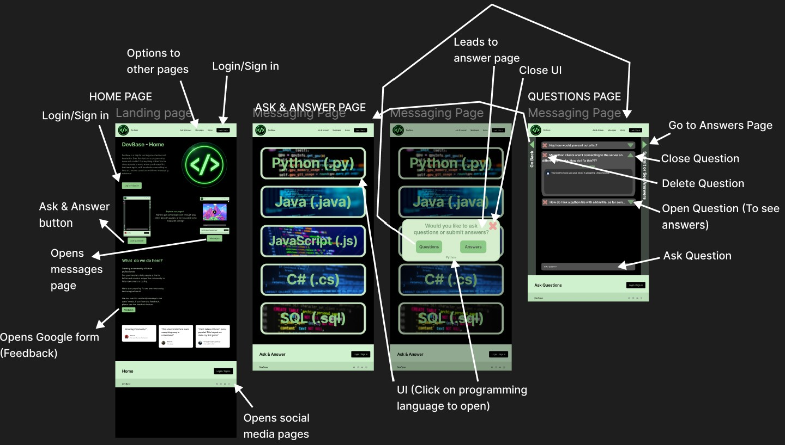

No changes necessary.

## Week 3

| Choices | Description |
| ----------- | ----------- |
| Colour Palette | Black and green (Simular as original design). Light green as the main background colour, black for the text and UI elements. They constrast and therefore will stick out more. The lighter colours of the background will allow it to be within the user's focus more. |
| Typography | Clear fonts such as Arial. This allows users to read through the text easier and match the minimalist design of the UI elements. |
| Image | Still a few image, but a few more to fill in some of the white space. The images are light with curved corners, to contrast the darker menu screens. |

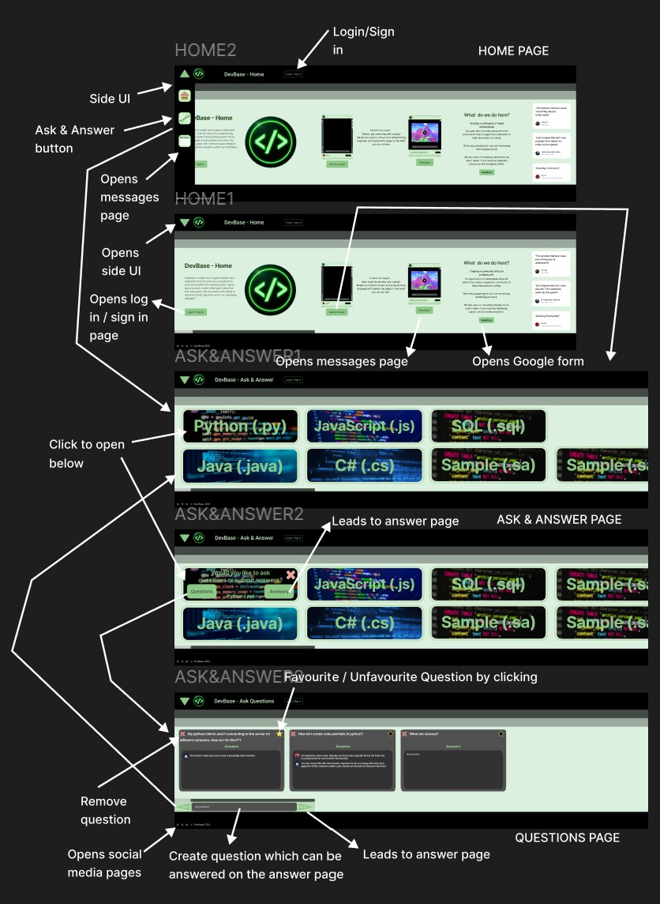

Changes needed:
- Edit fonts to make homepage look more interesting
- Experiment with white space

Alternative design is more liked than original design.

## Week 4

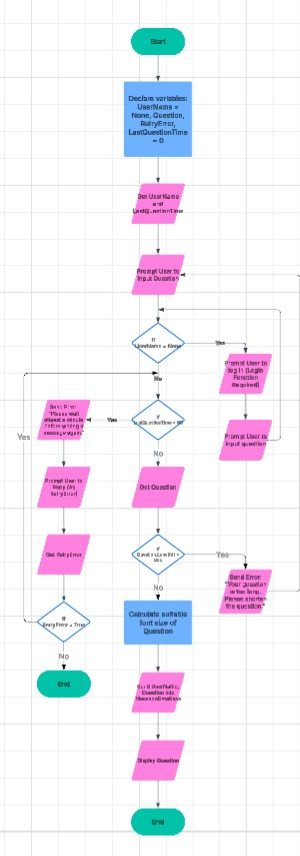
[Lucidchart Algorithms](https://lucid.app/lucidchart/442a199c-afc6-4a7c-9667-eb764b94127b/edit?invitationId=inv_4c1159e6-b4fb-4316-ae34-f7f1368fcc92)

| Test Case ID | Test Case Name | Preconditions | Test Steps | Expected Result | Actual Result | Pass/Fail | Priority |
| ----------- | ----------- | ----------- | ----------- | ----------- | ----------- | ----------- | ----------- |
| TCM001 | Check user message | User must have a registered account. | 1. User enters 'Questions' page, 2. User types a message, 3. User submits message | Message is inputted into Questions database. | N/A | N/A | High |
| TCM002 | Visualise user message | User must have a registered account. | 1. User enters 'Questions' page, 2. User types a message, 3. User submits message, 4. Message is submitted into Questions database | Message is visualised on user's screen | N/A | N/A | High |

## Week 5
Notes:
I set up the python environment, following a document and making sure that the SQL database was up and functional. I also managed to input some data into the 3 tables created.
- Added sample data into database
- 3 tables: Users, Messages and Answers
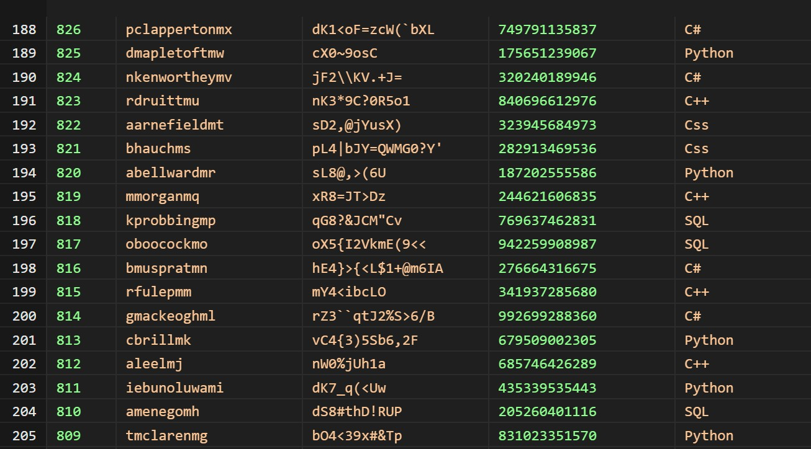

The Users table contains the User Id, username, password, phone number (I might not include this into the actual website) and programming language (Which will be important for the messaging).
The messages table includes its Id, the user id who posted it, the content of the message, time stamp and which programming language it is referring to (For organisation). The time stamp will mainly be implemented to prevent spam.
The answers table will include its id, the message id which is being responded to, the user id who posted it, the content of the answer and time stamp (Also to prevent spam).

## Week 6
Notes:
Began setting up the website and attempted (but failed) to link the SQL database to it.
- Added most of the HTML files
- Added 'main.py' file
- Tested SQL queries
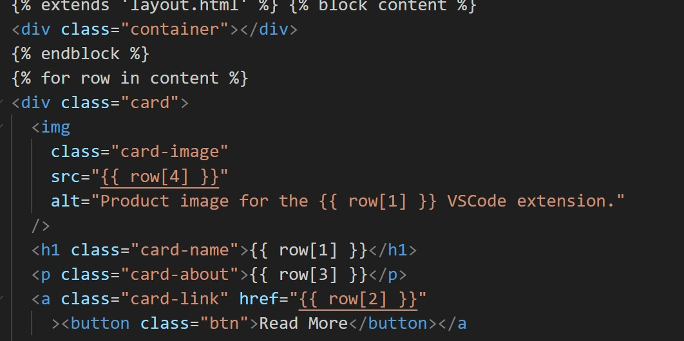
The image above displays 'index.html', though this will likely not be used for the final product as it doesn't fit for what I'm planning for.
Using the SQL database, I have tested a few commands such as SELECT and WHERE to ensure that it's functioning properly.

## Week 7
Notes:
Website is up and running! Making homepage + designing it. Relearning how to use HTML and CSS.
- Designed a bit of the homepage
- Created top-menu
- Made website functional
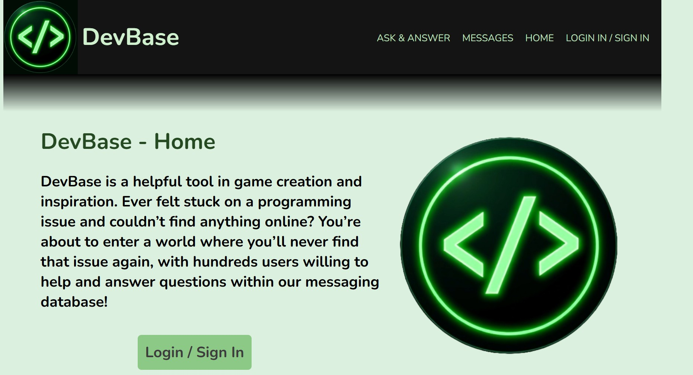
This is the homepage. I'm attempting it to closely resemble the figma images, and as guided by my client, I chose the first design but gave it the colour scheme of the 2nd design to have the content stick out more whilst still having the menu contrast.

## Week 8
Notes:
Added a javascript file and linked it.
- Added 'app.js'
- Started creating 'Ask and Answer' page
- Attempted to create an overlay
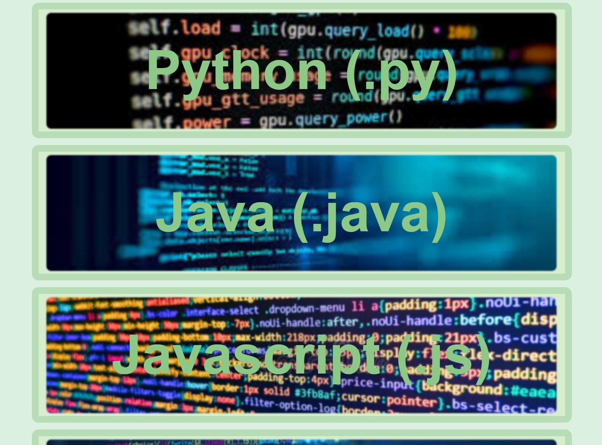
I didn't necessarily finish the homepage, but I started making the ask & answer page as the homepage requires images from the other pages. I wanted to add an overlay, but due to the limiting nature of html without being forced to change to a different page, I started using javascript.
The implementation of alternative pages was also quite difficult to make, as I needed to figure how (Somewhat) how main.py was able to support the first page and use that to have the other pages function.

## Week 9
Notes:
Added more java interactivity + started making login screen.
- Finished creating the overlay for the ask and answer page
- Started trying to make the login screen
- Attempted to understand how to connect the SQL databases to html using the python file
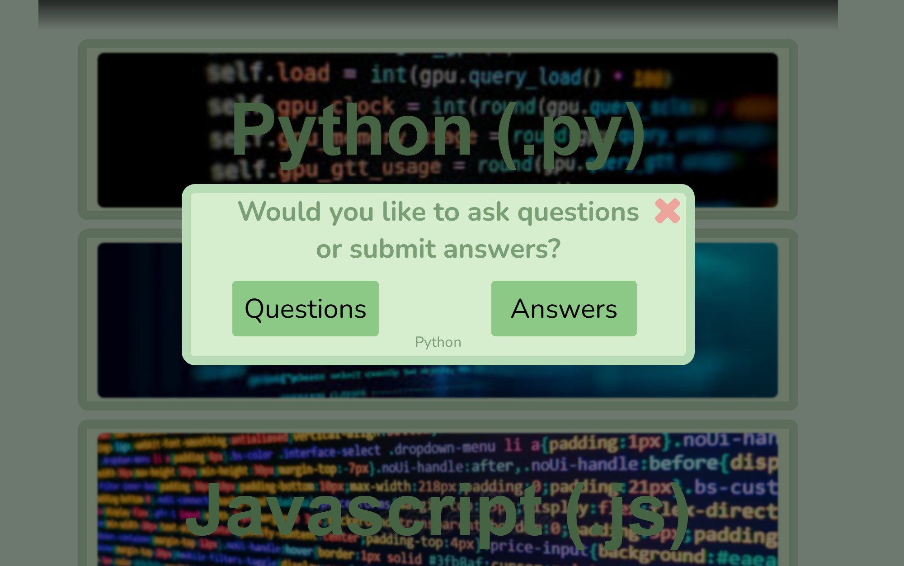
The overlay took a lot of effort, especially with learning how javascript works and all the new functions I had to learn. With the login screen, because I still didn't need any of the SQL databases until now, I also need to actually learn how to use flask, inputs and forms.

## Week 10
Notes:
Finished login screen and connected it to my users SQL database.
- Completely designed and added functionality to login screen
- Learnt how to connect html to SQL
- Learnt how to use forms and inputs
- Ran website to get lighthouse report
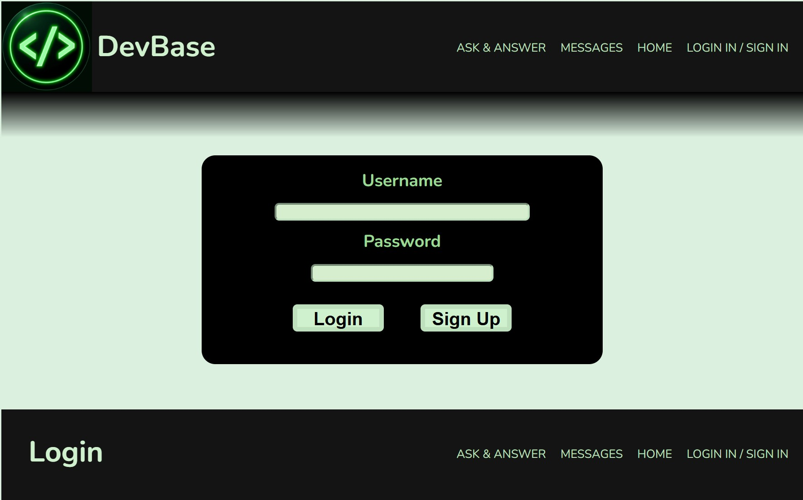
The login page probably will take the longest to complete out of all the pages, due to now having to learn about SQL, Python, Html and Javascript, then connecting them all together. I haven't quite added anything interactivity once you've logged (and signed) in, but since I know how to use all the programming languages, I should be able to speed up progress.

## Holidays
Notes:
Added Creating messages, logging out and changing password
- Added profile overlay with a log out button and changing password
- Added messages page
- Implemented ability to create messages and display it on html
- Ran website to get lighthouse report
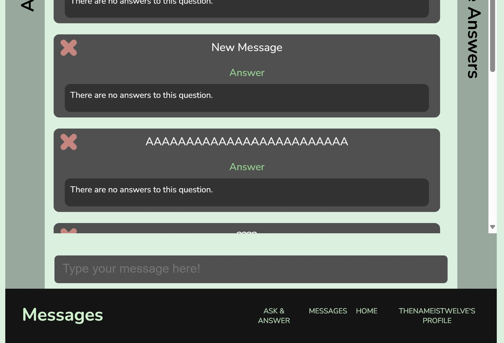
I didn't make a lot of progress during the holidays as I had limited access to the the files, but I still managed to include vital parts of the web application.
The creation of messages (Though not replies) took a while due to the interesting mechanics of having SQL and Javascript communicate (Javascript had to using html to send a form to Python to get data from SQL then send a variable to html for javascript to read), but eventually the messages were visualised on the webpage, and they could be deleted or ignored (With identical messaages).

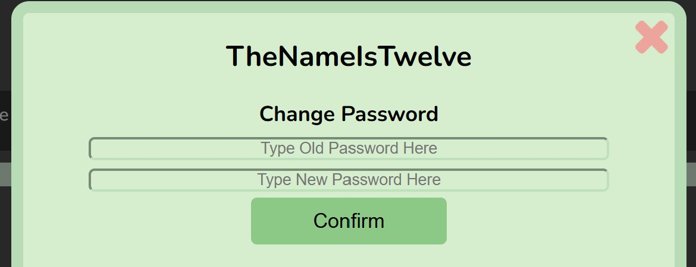
This logout overlay also took a while to add, as it forced me to deal with forms and SQL a lot more (Which later helped me make the messages webpage), but it works well without any bugs (that I could find), and I'm fairly satisfied with the result.

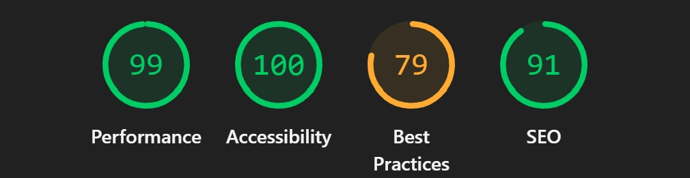
Suprisingly, my lighthouse rating throughout the creation of the website improved a decent amount (I originally had an average of ~79), though my 'Best Practices remained around 79 the entire time. Each webpage had a different lighthouse report rating, and this was the report for the 'Messages' page.

## Week 1
Notes:
Messaging system fully functional
- Finished answers page
- Included ability to reply to messages
- Added message filter
- Added messaging 'groups' (Programming languages)
- Fixed a lot of bugs

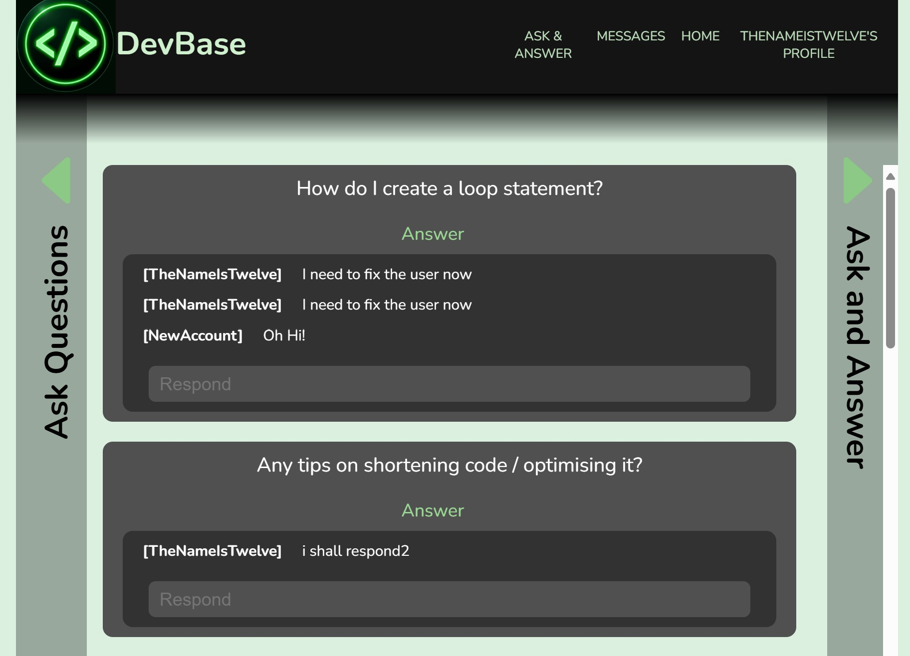
The answers page was the final of the core mechanics I had to add before submission, but it didn't take as long as I expected. Though there were a few issues with the database being 1 value offset from what was required, and the rearrangement of lists also messed things up, I eventually were able to fix all of the bugs.
I also quickly added offline functionality, though this was mainly just through copying the code, simular to setting up the python environment.

For the website, please use Google Chrome to have it function, as a lot of elements are based on screen size and break if the screen size breaks.